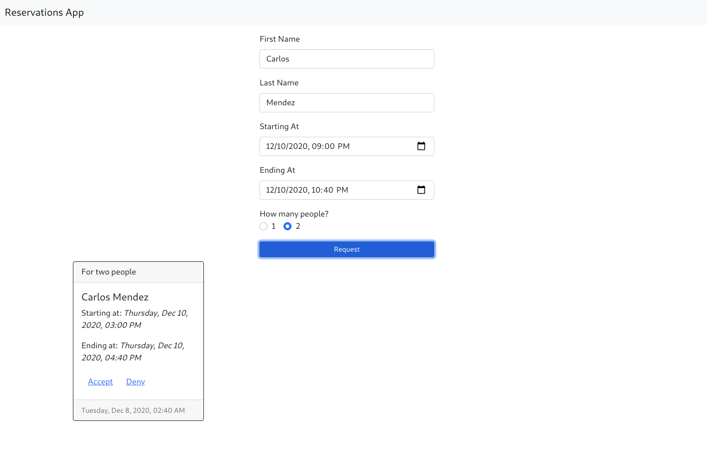
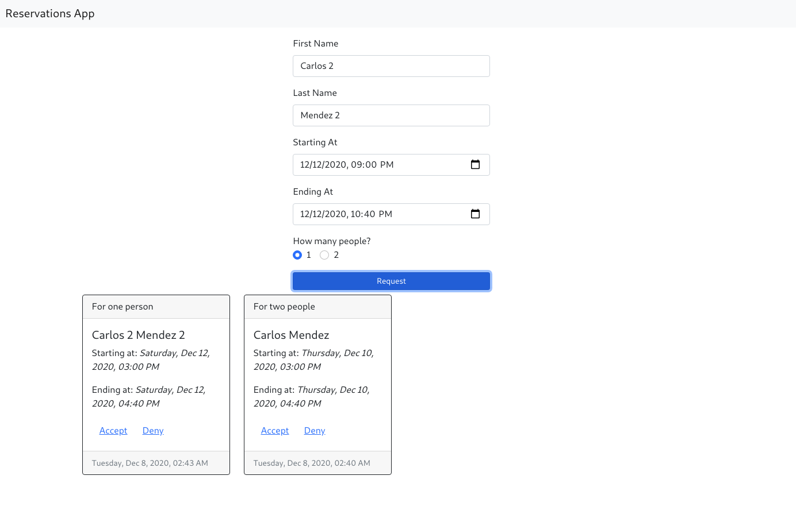
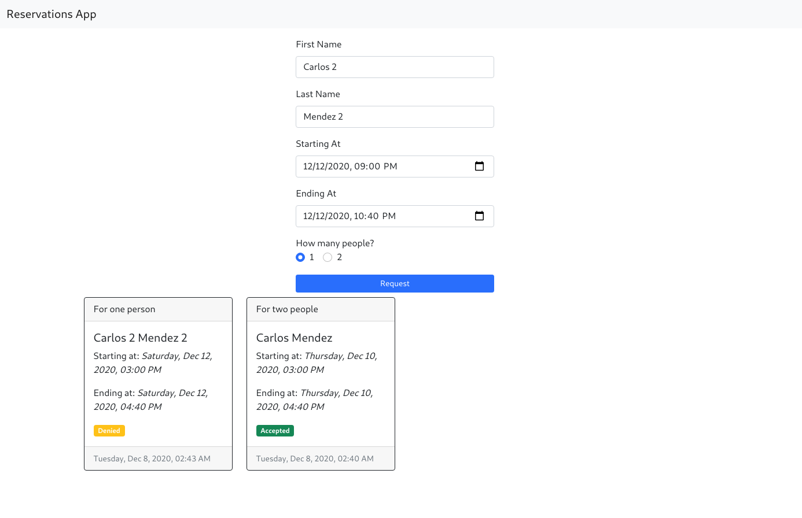

# General desccription - Coworkers Requests

Parse an input file containing multiple coworking reservation requests. A request should contain a person's name, start time, and end time. Based on a max of two seats, accept and reject reservations on a first-come, first-served basis. Output acceptance/rejections to stdout.

#### Image 1.


#### Image 2.


#### Image 3.


## What technologies are used in this project?
It make use of Docker, Django-Postgres, and React-Typescript-Bootstrap.

- [Docker](https://www.docker.com/)
- [Django](https://www.djangoproject.com/)
- [Postgres](https://www.postgresql.org/)
- [React](https://reactjs.org/)
- [Typescript](https://www.typescriptlang.org/)
- [Bootstrap](https://getbootstrap.com/)

# How to use it

-   Make sure you have [Docker installed](https://docs.docker.com/docker-for-mac/install/) on your system,
-   Download this repo
-   Navigate in your terminal to the directory you cloned this. The first time you should run: 
```
docker-compose build

(WARNING - Please run this command twice. The Docker build have a bug).
docker-compose run api python manage.py makemigrations

docker-compose run api python manage.py migrate
```
-   After you can just simple run `docker-compose up`

-   Now you can see the project in http://localhost:8080/

## Author

Carlos Mendez

### Created at

December 8th, 2020


